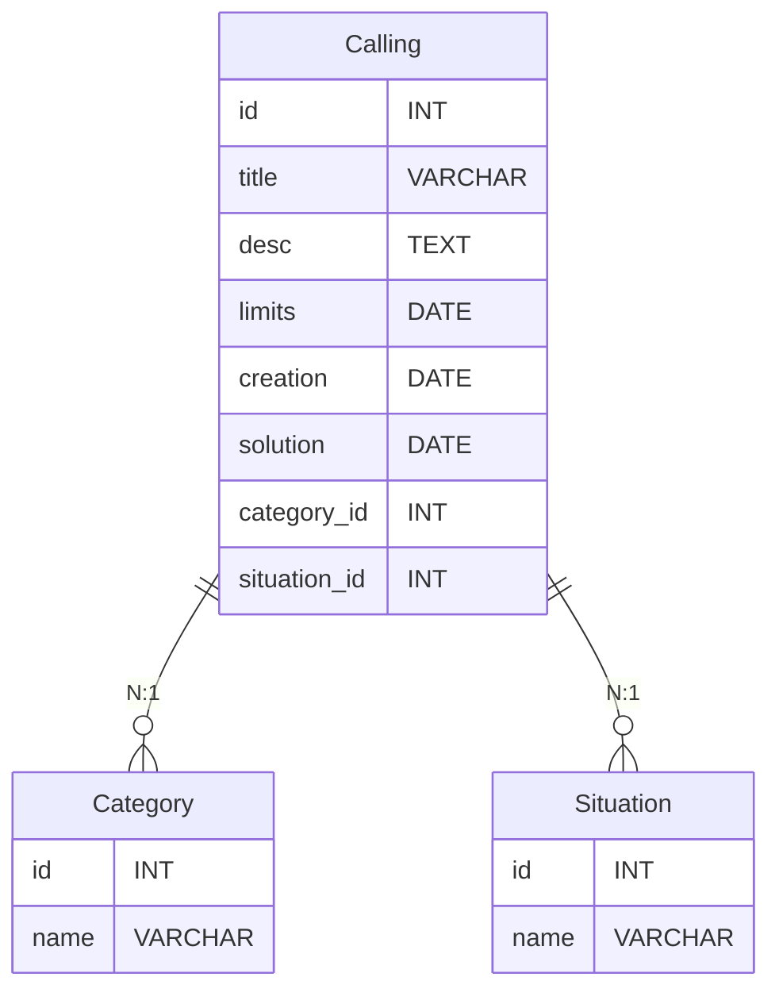

## 💻 PLSS | Chamados 

O que foi usado na criação do projeto:

- 🤖 Linguagem principal Backend - **[PHP 8.2.12](https://www.php.net)** 
- ⚙️ Framework PHP - **[Laravel](https://laravel.com)** 
- 📒 Toolkit de estilização baseado em Sass - **[Bootstrap](https://getbootstrap.com)**
- 🎲 Banco de dados - **[MySQL](https://www.mysql.com)** 
- 🛅 Host - **[XAMPP](https://www.apachefriends.org/pt_br/index.html)**

Resumo:<br>
Este projeto é um CRUD utilizando PHP com Laravel para a geração de uma aplicação de chamados. Os chamados são listados e o usuário pode fazer todas as operações em cada chamado.


## 🔑 Diagrama de Entidade Relacionamento:



Este diagrama representa três entidades: Calling (Chamado), Category (Categoria) e Situation (Situação), juntamente com seus atributos correspondentes e relacionamentos entre eles.

## ⬇️ "Build" do projeto ⬇️

### 🛠️ 1º Passo (Habilitando XAMPP e etc.)
Desenvolvi a aplicação utilizando XAMPP, então, para começarmos, o ```git clone``` na sua máquina deve ser direto na sua pasta htdocs do XAMPP: (```C:\xampp\htdocs```)

Não se esqueça de ligar os servidores Apache e MySQL no XAMPP Control Panel !!!

### 🚀 2º Passo (Criando DB e Servindo a aplicação)
Para o funcionamento da aplicação, devemos acessar o banco de dados através do PHPmyAdmin pelo endereço: ```http://localhost/phpmyadmin/```, crie uma database com o nome ```plss-app```.

Agora com o terminal apontando para: ```C:\xampp\htdocs\plss-app>```, sirva a aplicação com Artisan: ```php artisan serve```

### 📝 3º Passo (Inserindo alguns dados no DB)
Dentro das tabelas ```categories``` e ```situations``` crie os valores nesta ordem:

- Categories:
  
    ```INSERT INTO `categories`(`name`) VALUES ('Hardware');```

    ```INSERT INTO `categories`(`name`) VALUES ('Software');```

    ```INSERT INTO `categories`(`name`) VALUES ('Servidor');```

    ```INSERT INTO `categories`(`name`) VALUES ('Outro');```
- Situations:
  
   ```INSERT INTO `situations`(`name`) VALUES (`Novo');```
  
   ```INSERT INTO situations(`name`) VALUES ('Pendente');```

   ```INSERT INTO situations(`name`) VALUES ('Resolvido');```

### 🤓 4º Passo (Acessando a aplicação)
O próprio Artisan te gerará um link de acesso quando realizar o ```serve```, acesse este link e pronto !

Obs: para mim, o link mostrado foi este: http://127.0.0.1:8000

Pronto ! A aplicação já pode ser utilizada.

## 🗒️ Licença

Esse software foi licenciado através da [MIT license](https://opensource.org/licenses/MIT).
